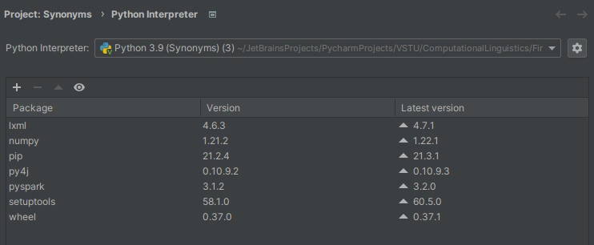
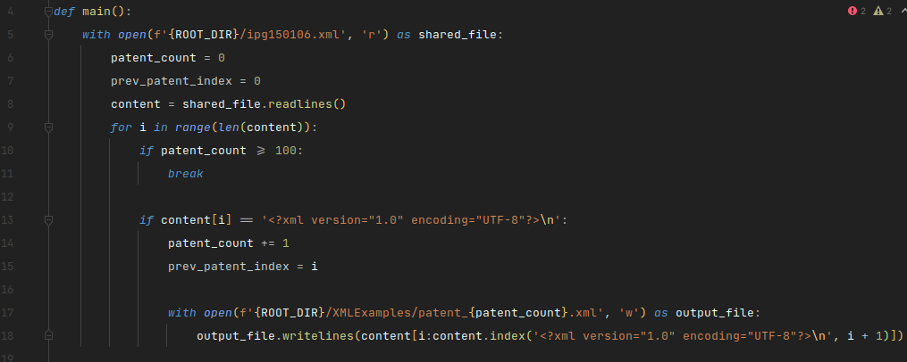
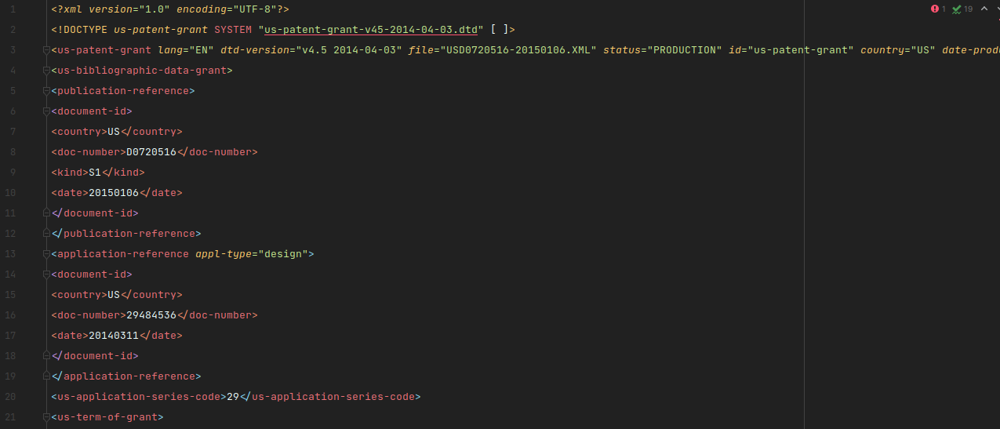
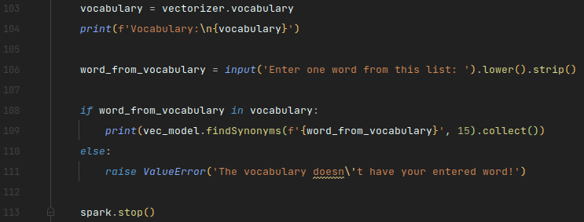
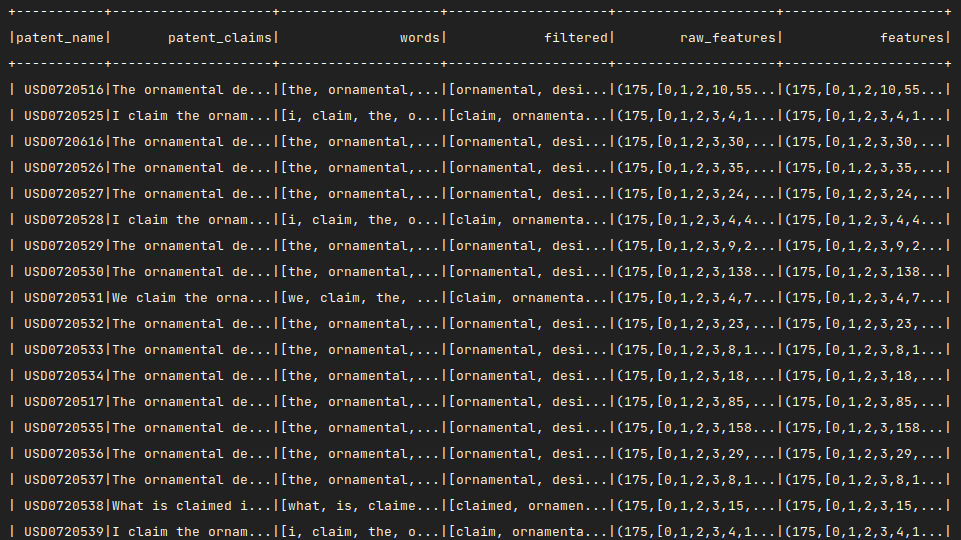
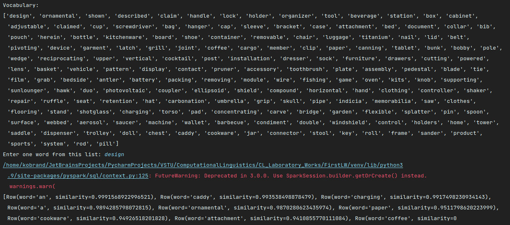

## Лабораторная работа №1 - Статистический анализ текстовых данных
### Задание
Взять произвольные 100 патентов из хранилища USPTO (https://www.google.com/googlebooks/uspto-patents-grants-text.html).
Для каждого из патентов определить его значимые признаки.
На данном множестве патентов построить модель Word2Vec. На основе данной модели предоставить пользователю получать 
список контекстных синонимов для слова.

### Необходимые модули
Для выполнения лабораторной работы №1 понадобятся модули `pyspark`, `lxml` и `numpy`. Остальные модули, необходимые для 
работы этих трех вышеперечисленных, будут установлены автоматически.

### Реализация задания

Сперва необходимо взять произвольные 100 патентов из хранилища USPTO. Каждый из предложенных xml-файлов содержит в себе
порядка 5000-6000 патентов. Необходимо написать парсер, который позволит нам взять только лишь 100 патентов.

Можно было, конечно, воспользоваться средствами ранее установленного модуля `lxml`, но можно также обойтись и 
стандартными инструментами языка Python.

Содержание патента:

Для определения значимых признаков патента можно воспользоваться скриптом, который содержится в приложении 
к методическому пособию.

Если возникла ошибка во время выполнения скрипта `java.lang.OutOfMemoryError: Java heap space`, то попробуйте обновить
на Linux _JDK_ и _JRE_.

Также для поиска контекстных синонимов патента добавим в конец скрипта следующий код:

Стоит отметить, что точность найденных контекстных синонимов зависит от величины размера вектора в модели Word2Vec.
Лучше выставлять данный параметр на 100, как это реализовано по умолчанию. Также для повышения точности требуется 
гораздо больший объем данных, нежели чем 100 патентов. Поэтому в данной работе Вы можете и не увидеть 
правильных контекстных синонимов для исследуемых патентов.

### Результат работы
Значимые признаки патента:

Список контекстных синонимов патента:

Apache Spark - основа выбора при обработке больших данных. Он довольно быстр и имеет дружелюбный программный интерфейс,
что позволяет оперативно и качественно работать с большими объемами текстовых данных.
