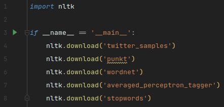
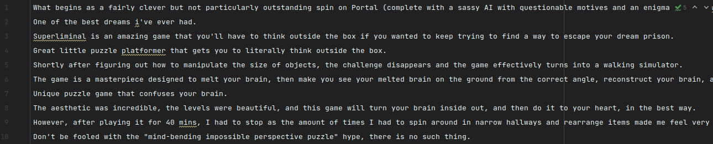
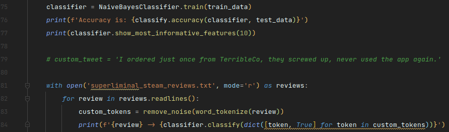
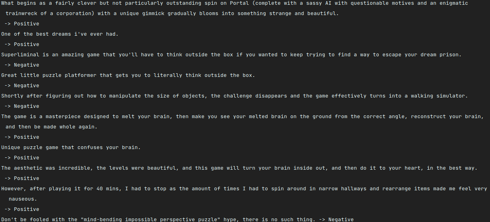

## Лабораторная работа №4 - Анализ тональности текста
### Задание
Провести анализ тональности 10 произвольно выбранных предложений.

### Необходимые модули
Для выполнения лабораторной работы №4 понадобятся модули `pymystem3` и `nltk`. Остальные модули, необходимые для 
работы этих двух вышеперечисленных, будут установлены автоматически.

Также необходимо скачать следующие ресурсы модуля `nltk`:

### Реализация задания
Согласно заданию, необходимо провести анализ тональности 10 произвольно выбранных предложений. Выберем для анализа, 
например, отзывы об игре-головоломке _'Superliminal'_ в игровой площадке Steam.

Добавим в конец скрипта фрагмент кода, позволяющий считывать отзывы пользователей с заранее подготовленного текстового
файла для дальнейшей классификации тональности.

### Результат работы

Стоит отметить, что далеко не всегда мы можем получить корректный ответ. 
Наивный байесовский классификатор обучается от раза к разу на разных наборах данных, так как присутствует перемешивание
позитивного и негативного датасетов между собой случайным образом. Если этого не делать, то наша полученная модель 
обучалась бы только в большинстве своем на позитивных или, наоборот, негативных твитах, что не позволит в дальнейшем
адекватно выявлять тональность текста. Также нельзя не упомянуть и о том, что классификатор на данный момент довольно
грубо выявляет тональность предложений, так как он не воспринимает такие вещи, как, например, сарказм, сочувствие,
волнение или гнев, необходимо дополнительно усилить рассматриваемую модель. 
