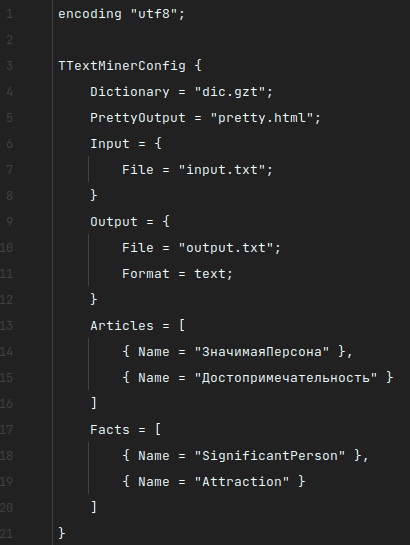
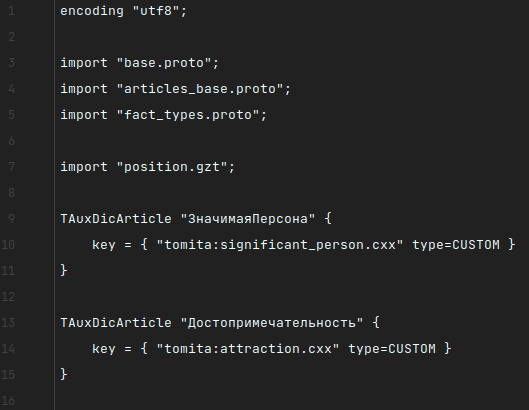
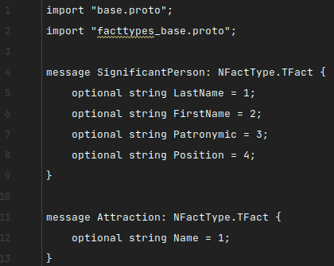
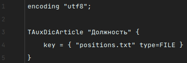
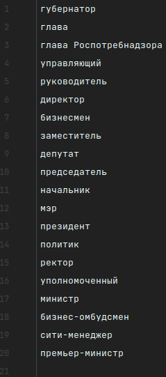
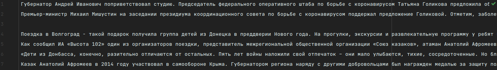
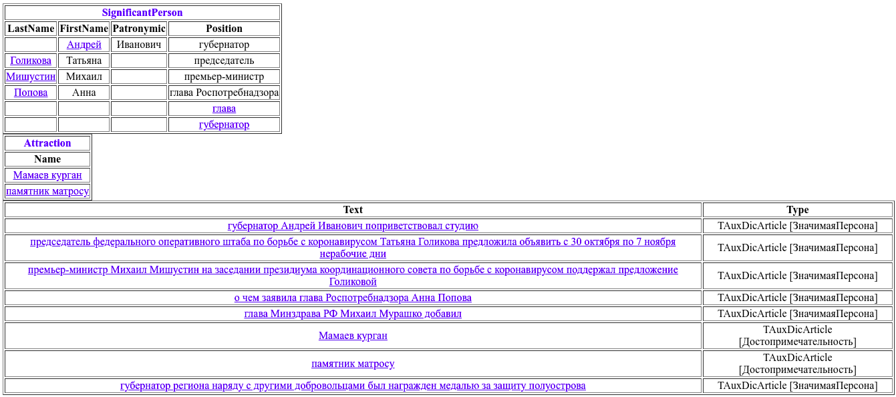
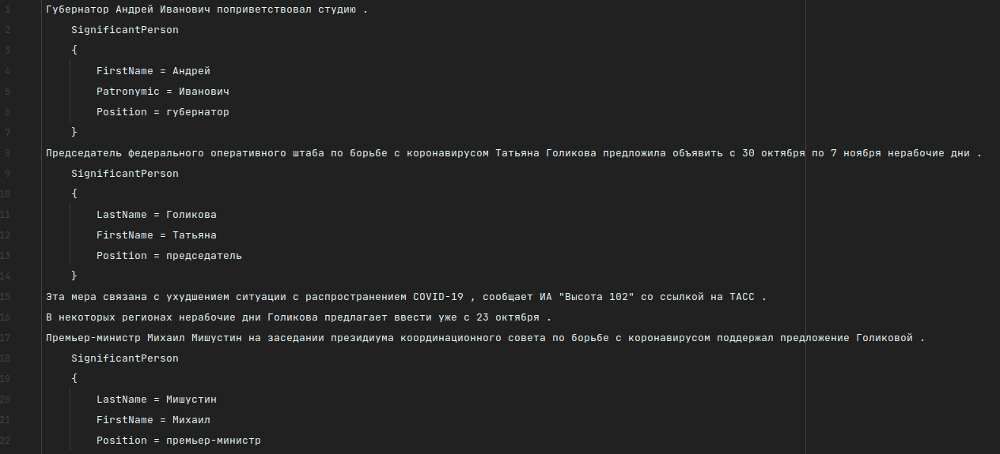
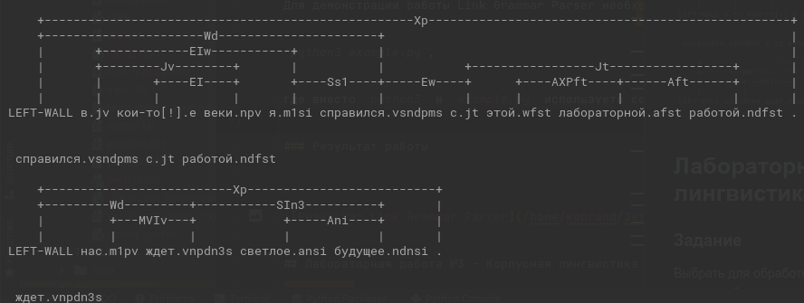

## Лабораторная работа №2 - Морфологический и синтаксический анализ
### Задание
1. Произвести анализ текста и извлечение из него информации, используя Tomita-parser.
   - Извлечение фамилий политиков из текста;
   - Извлечение названий культурных строений (музеи, галереи, памятники и т.д.).
2. Показать работу LinkGrammar на произвольном предложении.

### Необходимые модули
Для выполнения лабораторной работы №2 понадобится скомпилировать два проекта:
[Tomita-parser](https://github.com/yandex/tomita-parser) и [Link Grammar Parser](https://github.com/opencog/link-grammar).

Установка парсеров происходит согласно инструкциям, приведенных в README.md файлах в каждом из репозиториев парсеров.

Для работы с Tomita-parser достаточно лишь будет скомпилировать проект, где после получим исполняемый файл 
_tomita-parser_, необходимый для дальнейшего выполнения работы. Данная компиляция представляла под собой множество 
проблем, связанных с наличием (отсутствием) на Linux тех или иных библиотек, необходимых для работы парсера. 
Для простоты и удобства данный исполняемый файл _tomita-parser_ уже присутствует в текущем репозитории.

Если возникнет желание все-таки скомпилировать проект, то лучше это делать на версиях Ubuntu 12.04, 14.04 или 18.04. 
На этих версиях доступны необходимые библиотеки, необходимые для работы Tomita-parser.

В случае с Link Grammar Parser придется компилировать проект. На компьютере должен быть заранее установлен 
интерпретатор Python версии 3.x.

Если возникнет ошибка при сборке данного проекта по инструкции из репозитория Link Grammar Parser, а именно при 
прохождении Python-тестов, то, возможно, Вам поможет установка следующей переменной окружения в Linux:

`export PYTHONPATH=/usr/local/lib/python3.6/site-packages/linkgrammar`,

где вместо _'python3.6'_ необходимо указать установленную версию интерпретатора Python.

Также, возможно, потребуется установить переменную окружения _LC_ALL_ на русскую локаль. Если данной локали 
не установлено, то потребуется ее скачать.

`export LC_ALL`

`LC_ALL="ru_RU.utf8"`

### Реализация задания

Томита-парсер работает с кодировкой _UTF-8_, поэтому все файлы необходимо сохранить в данной кодировке.
В начале каждого файла, содержащего код программы, **кроме** _fact_types.proto_, указать данную строку:

`encoding "utf8";`

Для выполнения работы при помощи Tomita-parser необходимо будет создать следующие файлы:

- config.proto - файл конфигурации парсера;

- attractions.cxx и significant_person.cxx - файлы с грамматикой;
- dic.gzt - газеттир, файл-словарь; 

- fact_types.proto - файл с извлекаемыми фактами;

- position.gzt - газеттир для должностей важных персон;

- positions.txt - текстовый файл, хранящий список возможных важных должностей;

- input.txt - файл с исходным текстом.

Tomita-parser можно запустить, находясь в папке с исполняемым файлом _tomita-parser_ и остальными вышеописанными файлами, если написать следующую команду в консоли:

`./tomita-parser config.proto`

Для демонстрации работы Link Grammar Parser можете либо оставить, либо изменить в скрипте переменную _text_.

Запуск необходимо произвести в консоли с использованием следующей команды:

`python3 example.py`,

где вместо _python3_ и _example.py_ используете собственный интерпретатор Python и название Вашего файла соответственно.

### Результат работы

Вывод в pretty.html:

Вывод в output.txt:

Tomita-parser - инструмент для извлечения структурированных данных (фактов) из текста на естественном языке. Парсер
позволяет написать свои грамматики, словари, чтобы извлекать только необходимые нам факты.

Вывод Link Grammar Parser:

На примере Link Grammar Parser была возможность увидеть "составное" представление предложения: с указанеим имен 
существительных, глагольных фраз и т.д. Данный парсер хоть и является синтаксическим анализатором английского языка,
основанный на теории синтаксиса английского языка, но он также предоставляет возможность обрабатывать текст на русском
языке, что было необходимо в рамках данной работы.
