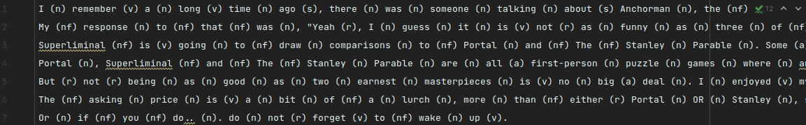

## Лабораторная работа №3 - Корпусная лингвистика
### Задание
Выбрать для обработки любой англоязычный текст длиной не менее 500 символов. Написать Python-скрипт, выполняющий задачу
в соответствии с вариантом:
1. Для каждого слова в тексте вывести в скобках обозначение части речи.

### Необходимые модули
Для выполнения лабораторной работы №3 понадобятся модули `ufal.udpipe` и `nltk`. Остальные модули, необходимые для 
работы этих двух вышеперечисленных, будут установлены автоматически.

### Реализация задания
Согласно заданию, необходимо для каждого слова в англоязычном тексте, состоящем из не менее 500 символов, вывести в 
скобках обозначение части речи. Выберем для анализа, например, отзыв об игре-головоломке 'Superliminal' 
в игровой площадке Steam.

В данном фрагменте кода присутствует довольно запутанная с первого взгляда логика вывода части речи слова в скобках.
Связано это с желанием вывода части речи до непосредственно знаков препинания.

Например, как это могло быть реализовано в простом виде:

`I (n) remember (v) a (n) long (v) time (n) ago, (s) ...`

Как это предполагалось мной:

`I (n) remember (v) a (n) long (v) time (n) ago (s), ...`

В связи с желанием сохранить пунктуацию в тексте, а также указать часть речи слова непосредственно перед знаками
пунктуации, а не после, и была реализована такая логика обработки текста.

Вторая часть лабораторной работы подразумевает работу с модулем UDPipe - обучаемым инструментом для токенизации, 
тегирования, лемматизации и анализа зависимостей. Для выполнения данного задания достаточно добиться запуска 
существующей программы.

Скачать модель русского языка можно по ссылке: 

https://yadi.sk/d/b19-KhrAjMHgmg

### Результат работы

Несмотря на использование в данной работе лексической базы данных английского языка WordNet, её возможностей все-таки 
не хватает для точного выявления части речи в некоторых ситуациях. В случаях, например, с словом _'My'_ WordNet 
не находит вовсе никакой части речи, а слово _'going'_ в контексте _'Superliminal is going to draw ...'_ упоминается 
как существительное.
